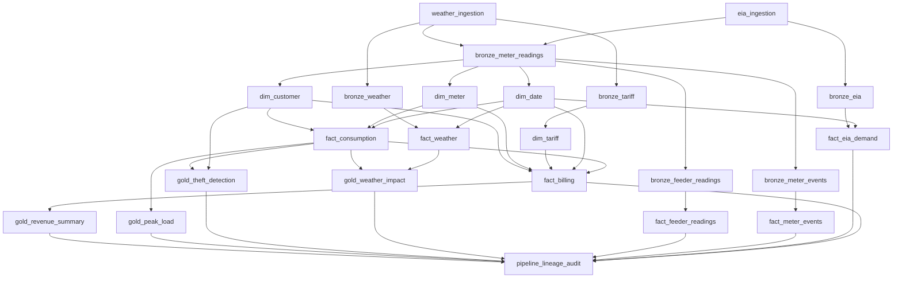

# Energy Smart Meter Analytics Platform

## 1. Purpose

The Energy Smart Meter Analytics Platform is a Databricks and PySpark data platform for ingesting energy, weather, tariff, smart-meter, feeder telemetry, and meter-event data and transforming it into analytics-ready Delta tables.

The platform follows a layered data architecture:

```text
External sources and files
        |
        v
Raw files in Unity Catalog Volumes
        |
        v
Bronze: source-shaped Delta tables
        |
        v
Silver: cleaned dimensions and facts
        |
        v
Gold: business aggregates and analytics outputs
        |
        v
Audit: pipeline lineage and run history
```

The implementation uses Databricks Asset Bundles to deploy the pipeline as a multi-task Databricks Job.

## 2. Technology Stack

- Databricks Jobs and Databricks Asset Bundles
- Apache Spark / PySpark
- Delta Lake
- Unity Catalog
- Python
- Databricks Volumes
- Open-Meteo API
- U.S. Energy Information Administration API
- Synthetic feeder telemetry generated from smart-meter reading timestamps
- Synthetic meter tamper and status events generated from smart-meter meters
- Pandas and OpenPyXL for tariff-file ingestion

## 3. Repository Layout

```text
energy-smart-meter/
|
|-- databricks.yml                 # Asset Bundle configuration
|-- requirements.txt               # Python requirements
|-- README.md                      # Short project summary
|-- resources/
|   `-- jobs/
|       `-- energy_pipeline.yml    # Main multi-task job
|-- src/
|   |-- ingestion/                 # External API and file ingestion
|   |-- bronze/                    # Raw-to-Bronze transformations
|   |-- silver/                    # Dimensions, facts, DQ, schema drift
|   |-- gold/                     # Business-facing aggregates
|   `-- audit/                    # Pipeline lineage history
|-- datasets/                     # Local source data; excluded from bundle sync
|-- docs/                         # Project documentation
`-- spark-warehouse/              # Local Spark output area
```

## 4. Data Sources

### 4.1 Open-Meteo weather API

The weather ingestion task requests hourly weather data for:

- Latitude: `52.52`
- Longitude: `13.41`
- Temperature
- Relative humidity
- Wind speed
- Precipitation

Raw weather files are written to:

`/Volumes/energy/bronze/raw/weather/`

The ingestion script uses the previous pipeline audit timestamp, when available, to request a date range beginning at the prior pipeline start date.

### 4.2 EIA API

The EIA ingestion task requests hourly electricity demand data from the EIA RTO region-data endpoint.

Raw EIA files are written to:

`/Volumes/energy/bronze/raw/eia/`

The script reads the latest available pipeline watermark from `energy.audit.pipeline_lineage` and sends it as the EIA API `start` parameter. The first run has no watermark and uses the bootstrap request. Raw records are appended under a load-specific path for later deduplication.

The EIA API key is resolved in this order:

1. `EIA_API_KEY` environment variable
2. `DATABRICKS_SECRET_EIA_API_KEY` environment variable
3. Databricks secret scope `energy-secrets`, key `eia-api-key`

### 4.3 Smart-meter data

Smart-meter readings are sourced from CSV files under the meter dataset area and copied or made available through the raw Volume path:

`/Volumes/energy/bronze/raw/meter_readings/*.csv`

The primary business fields are `LCLid`, `DateTime`, `stdorToU`, and the half-hour consumption field renamed to `kwh_hh`.

### 4.4 Tariff data

The tariff source is an Excel file:

`/Volumes/energy/bronze/raw/tariff/Tariffs.xlsx`

The Bronze tariff job reads the file with Pandas and OpenPyXL, converts it to a Spark DataFrame, and writes it to a Delta table.

### 4.5 Local master and billing data

The repository also contains customer, meter, and billing datasets under `datasets/`. The current main pipeline derives customer, meter, and tariff dimensions primarily from Bronze data and calculates billing in the Silver layer.

## 5. Unity Catalog Structure

The implemented tables use the `energy` catalog and these schemas:

```text
energy.bronze
energy.silver
energy.gold
energy.audit
```

Raw files are stored separately in Volumes. A Volume path such as `/Volumes/energy/bronze/raw/eia` means:

- Catalog: `energy`
- Schema: `bronze`
- Volume: `raw`
- Directory: `eia`

## 6. Bronze Layer

Bronze tables preserve source-level data while adding ingestion metadata, source metadata, schema-drift metadata, and data-quality results.

| Table | Source | Main behavior |
|---|---|---|
| `energy.bronze.bronze_meter_readings` | Smart-meter CSV files | Reads CSV files, normalizes the consumption column, removes duplicate readings, and merges on `LCLid` plus `DateTime`. |
| `energy.bronze.bronze_weather` | Open-Meteo raw Parquet | Reads recursive raw files, removes duplicate timestamps, and merges on `timestamp`. |
| `energy.bronze.bronze_eia` | EIA raw Parquet | Reads recursive raw files, removes duplicate demand records, and merges on period, respondent, type, source system, and type name. |
| `energy.bronze.bronze_tariff` | Tariff Excel file | Reads tariff data with Pandas/OpenPyXL and merges on tariff datetime plus tariff value. |
| `energy.bronze.bronze_feeder_readings` | Generated feeder telemetry | Cross joins distinct smart-meter timestamps with four London feeder/substation pairs and appends simulated voltage, current, and active power readings. |
| `energy.bronze.bronze_meter_events` | Generated meter events | Generates low-frequency synthetic tamper/status events for existing meters and appends them with event metadata. |

Common Bronze metadata includes:

- `load_ts`
- `source_system`
- `source_file`
- `source_file_name`
- `source_file_size`
- `source_file_modification_time`
- `schema_drift_detected`
- `schema_drift_columns`
- `dq_passed`
- `dq_failed_checks`

The Bronze jobs use Delta Lake `MERGE` for repeatable reruns. Raw API and file ingestion remains append-oriented; Bronze processing is responsible for consolidation.

## 7. Silver Layer

The Silver layer creates reusable dimensions and facts for analytics.

### 7.1 Dimensions

#### `energy.silver.dim_customer`

Derived from smart-meter readings. It assigns a numeric `customer_key`, generated customer ID, tariff ID, status, and region. The natural source key is `LCLid`.

#### `energy.silver.dim_meter`

Derived from smart-meter readings. It assigns a numeric `meter_key`, generated meter ID, meter type, manufacturer, status, install date, and region. The natural source key is `LCLid`.

#### `energy.silver.dim_tariff`

Derived from the `stdorToU` values in smart-meter readings. It creates tariff IDs, names, descriptions, rates, status, and region.

Current rate rules:

- Standard tariff: `0.15` per kWh
- Time-of-use tariff: `0.18` per kWh

#### `energy.silver.dim_date`

Generates a date dimension from `2010-01-01` through `2035-12-31`. It includes date key, year, quarter, month, month name, day, week, weekday, day name, and weekend flag.

### 7.2 Facts

#### `energy.silver.fact_consumption`

Converts `kwh_hh` to numeric `consumption_kwh`, creates a date key, joins customer and meter keys, and stores the reading timestamp and consumption business key.

Business key:

`LCLid + DateTime`

#### `energy.silver.fact_weather`

Converts raw weather values into typed fields, adds date and hour keys, and stores temperature, humidity, wind speed, and precipitation.

Business key:

`yyyyMMdd_HH`

#### `energy.silver.fact_eia_demand`

Converts EIA period values into timestamps and demand MWh, adds date and hour keys, and standardizes respondent and type names.

Business key:

`respondent + period + type`

#### `energy.silver.fact_billing`

Builds monthly billing summaries from smart-meter readings joined to customer, meter, and tariff dimensions. The current implementation aggregates consumption by `LCLid` and billing month, applies a temporary rate rule, calculates bill amounts, and generates billing IDs.

Business key:

`customer_id + meter_id + billing_period`

The current temporary rate rule is:

- `TAR002`: `0.18` per kWh
- All other tariff IDs: `0.15` per kWh

The output includes consumption, bill amount, tariff identifiers, billing status, load timestamp, and source system. Billing is generated by the pipeline rather than read from a billing source table.

#### `energy.silver.fact_feeder_readings`

Reads `energy.bronze.bronze_feeder_readings`, filters failed Bronze DQ records, normalizes feeder and substation identifiers, casts telemetry values, and derives reading date and hour attributes.

Business key:

`feeder_id + reading_timestamp + reading_date`

The table is partitioned by `reading_date` on its initial write and uses Delta `MERGE` for subsequent loads.

#### `energy.silver.fact_meter_events`

Reads `energy.bronze.bronze_meter_events`, filters failed Bronze DQ records, standardizes event types and severity, and derives event date and hour attributes.

Business key:

`event_id + event_date`

The table is partitioned by `event_date` on its initial write and uses Delta `MERGE` for subsequent loads.

## 8. Gold Layer

Gold jobs create business-facing Delta tables from Silver facts.

| Table | Grain | Purpose |
|---|---|---|
| `energy.gold.gold_revenue_summary` | Billing month | Customer count, meter count, consumption, revenue, and average values. |
| `energy.gold.gold_peak_load` | Date and hour | Reading count, total consumption, average consumption, and maximum meter consumption. |
| `energy.gold.gold_theft_detection` | Customer/meter and billing month | Compares monthly consumption with tariff peer statistics and flags unusually low consumption. |
| `energy.gold.gold_weather_impact` | Date and hour | Combines hourly weather measurements with hourly consumption aggregates. |

Gold tables are created if missing and otherwise updated with Delta `MERGE` using their business grain.

## 9. Data Quality and Schema Drift

Shared data-quality, schema-drift, and configuration utilities live in `src/common/`. Bronze, Silver, and Gold jobs import the common helpers instead of keeping layer-local copies.

Supported checks include:

- Not-null checks
- Uniqueness checks
- Numeric range checks
- Empty-data checks

By default, failed checks are logged but do not stop the task because `fail_on_error=False`. Failure details are appended to:

`energy.silver.dq_failures`

The returned data includes:

- `dq_passed`
- `dq_failed_checks`

Gold checks validate output completeness, business-grain uniqueness, required keys, and non-negative or bounded measures before each Gold table is written or merged. The checks add `dq_passed` and `dq_failed_checks` to Gold outputs and log failures to `energy.silver.dq_failures`. Delta schema auto-merge configuration is currently inconsistent across Gold scripts, so adding these columns to already-existing Gold tables should be verified during deployment.

The shared schema-drift helper compares the current DataFrame schema with the existing target table and adds:

- `schema_drift_detected`
- `schema_drift_columns`

## 10. Pipeline Job and Dependency Flow

The main job is defined in [resources/jobs/energy_pipeline.yml](../resources/jobs/energy_pipeline.yml).



The audit task uses `run_if: ALL_DONE`, so it can record table lineage even when an upstream task reports a failure. This means audit completion does not imply that every upstream data-quality check passed.

The repository contains `ingest_feeder_readings.py`, `ingest_meter_events.py`, `fact_feeder_readings.py`, and `fact_meter_events.py`. These scripts are registered in the active `energy_pipeline_job` and are included in the final lineage audit dependency list.

## 11. Audit and Lineage

The audit job is implemented in `src/audit/pipeline_lineage.py` and writes to:

`energy.audit.pipeline_lineage`

The table records one row per discovered table in the Bronze, Silver, Gold, and Audit schemas for each pipeline run.

Current columns include:

- `run_id`
- `run_ts`
- `pipeline_start_ts`
- `pipeline_end_ts`
- `audit_task_start_ts`
- `audit_ts`
- `table_catalog`
- `table_schema`
- `table_name`
- `table_type`

All rows for one run intentionally share the same pipeline-level timestamps because they represent one pipeline execution. The table should be queried by `run_id` to reconstruct a run snapshot.

Example query:

```sql
SELECT
    run_id,
    pipeline_start_ts,
    pipeline_end_ts,
    table_schema,
    table_name,
    table_type
FROM energy.audit.pipeline_lineage
ORDER BY pipeline_start_ts DESC, table_schema, table_name;
```

The EIA and weather ingestion scripts use the latest available audit timestamp as an incremental source watermark. Raw source data is still appended, and downstream Bronze merges remove or consolidate duplicates.

## 12. Databricks Asset Bundle Configuration

The root bundle file is [databricks.yml](../databricks.yml).

Configured targets:

| Target | Mode | Catalog | Schema variable |
|---|---|---|---|
| `dev` | Development | `energy` | `energy_smart_meter_pipe_dev` |
| `qa` | Production | `energy` | `energy_smart_meter_pipe_qa` |
| `prod` | Production | `energy` | `energy_smart_meter_pipe_prod` |

Most current Python jobs use explicit table names such as `energy.silver.fact_consumption`; the bundle schema variable is present for bundle configuration but is not currently used to construct those table names.

The bundle excludes local datasets from workspace synchronization:

```yaml
sync:
  exclude:
    - datasets/**
```

## 13. Prerequisites

Before running the project, confirm:

1. Databricks CLI is installed and authenticated.
2. The `energy-dev` CLI profile exists.
3. The `energy` catalog and required schemas are available.
4. Unity Catalog Volume paths exist.
5. The EIA API key is configured through an environment variable or Databricks secret.
6. The `Tariffs.xlsx` file exists at the configured Volume path.
7. The Databricks compute environment includes `openpyxl>=3.1.5`.

## 14. Common Commands

Validate the bundle:

```powershell
databricks bundle validate --profile energy-dev
```

Deploy the bundle:

```powershell
databricks bundle deploy --profile energy-dev
```

Run the main pipeline:

```powershell
databricks bundle run energy_pipeline_job --profile energy-dev
```

Inspect a run:

```powershell
databricks jobs get-run <RUN_ID> --profile energy-dev
```

## 15. Operational Run Sequence

1. Weather and EIA ingestion tasks request source data.
2. Raw data is appended to Volume paths with load metadata.
3. Bronze tasks read raw files and merge them into Delta tables.
4. Silver dimensions and facts clean, type, join, and validate data.
5. Gold tasks compute business aggregates.
6. The audit task records table lineage and pipeline timing.
7. The next pipeline run reads the latest audit watermark for incremental API extraction.

## 16. Known Limitations and Follow-Up Work

- The current DQ framework logs failures but generally allows tasks to continue. Consider setting `fail_on_error=True` for critical checks or adding a pipeline-level quality gate.
- Existing Silver runs have reported duplicate business keys in consumption, weather, and EIA demand data. The current jobs deduplicate within each DataFrame and merge into target tables, but the source watermark and business-key strategy should be reviewed together.
- EIA and weather incremental filtering is timestamp/date based, while exact duplicate removal is deferred to downstream processing.
- `pipeline_end_ts` is captured by the audit task, so it represents audit-task execution time rather than the exact Databricks Job termination time. A Jobs API-based audit process would provide the authoritative end time.
- The audit task uses `ALL_DONE`; therefore it records lineage for unsuccessful runs but does not currently store each upstream task's result state.
- Some table names and source paths are hardcoded in Python. The bundle catalog/schema variables are not yet used consistently by the application code.
- Customer and meter surrogate keys are generated with window functions ordered by source IDs. A production implementation should use stable key management if source membership changes.
- Billing uses temporary tariff-rate logic in `fact_billing.py` and should eventually use a governed tariff schedule and effective dates.
- Billing currently uses hardcoded temporary tariff-rate logic in `fact_billing.py`; it should eventually use a governed tariff schedule with effective dates.
- The current `src/silver/dim_tariff.py` file also contains billing-oriented code in addition to tariff-dimension logic. These responsibilities should be separated so the active billing task has one authoritative implementation.
- Several source and transformation scripts contain exploratory output such as `show()` and row counts, which can create large job logs.
- The project contains a partially separate DLT-style implementation in some Silver files, while the active main job runs Python tasks and Delta tables directly. The preferred execution model should be documented and standardized.
- Feeder readings and meter events are currently synthetic/generated data. They should be replaced or clearly separated from production telemetry when real SCADA or AMI event sources become available.
- The feeder and meter-event generators append synthetic data on each run. Their rerun and deduplication behavior should be reviewed before treating the generated telemetry as production source data.

## 17. Ownership and Change Guidance

When adding a new source:

1. Add or verify its raw Volume path.
2. Create an ingestion script under `src/ingestion/`.
3. Create a Bronze table and merge key.
4. Add DQ and schema-drift metadata.
5. Add Silver dimensions or facts as needed.
6. Add Gold outputs only for stable business requirements.
7. Add the task and dependencies to `energy_pipeline.yml`.
8. Ensure the final audit task depends on the new task if it should be part of lineage.
9. Run bundle validation before deployment.

When changing a table schema:

1. Check downstream select and join columns.
2. Check Delta merge predicates.
3. Check the DQ and schema-drift behavior.
4. Check Gold dependencies and audit discovery.
5. Run a representative Databricks job before promoting the change.
